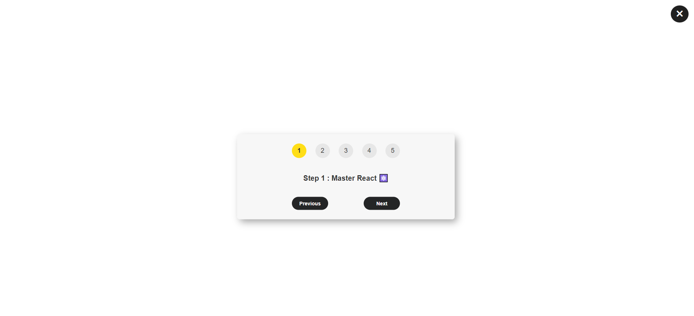

# React Steps Project

This project is a simple interactive guide that walks you through a series of steps to achieve your goals. Each step provides a piece of advice to help you progress towards your desired objective.

## Screenshot

## Getting Started

To get started with this project, follow these steps:

1. Clone this repository to your local machine using git clone.

2. Navigate to the project directory: cd react-steps-guide

3. Install the required dependencies: npm install

4. Start the development server: npm run dev

## Usage

This interactive guide helps you visualize and track your progress towards your goals. It provides a step-by-step approach along with advice for each step.

- Click the "Previous" and "Next" buttons to navigate through the steps.
- The current step number is highlighted in the step navigation.
- The corresponding message for each step is displayed.
- You can close the guide using the close button.
